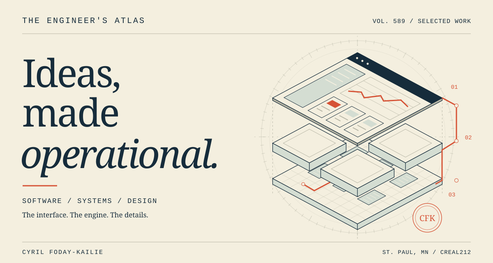
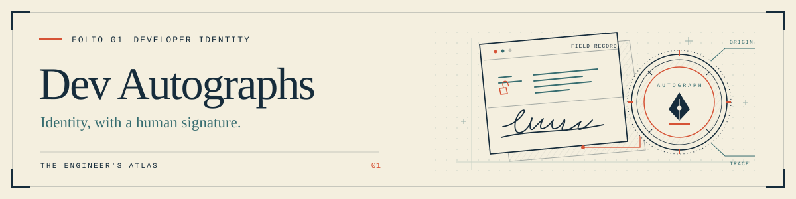
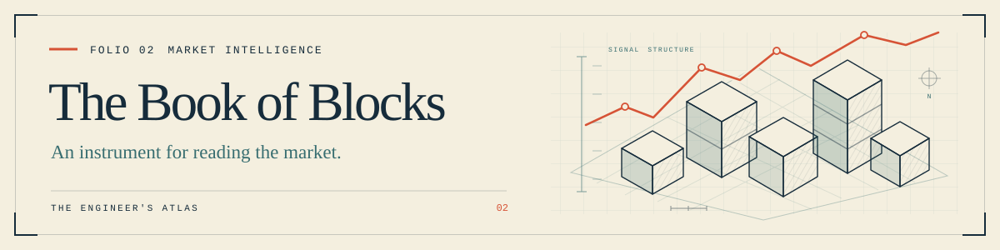
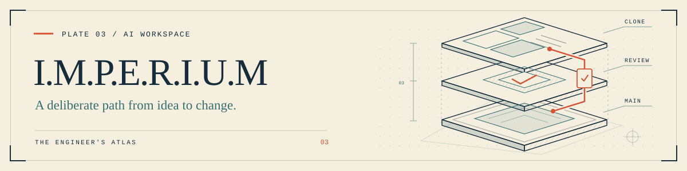
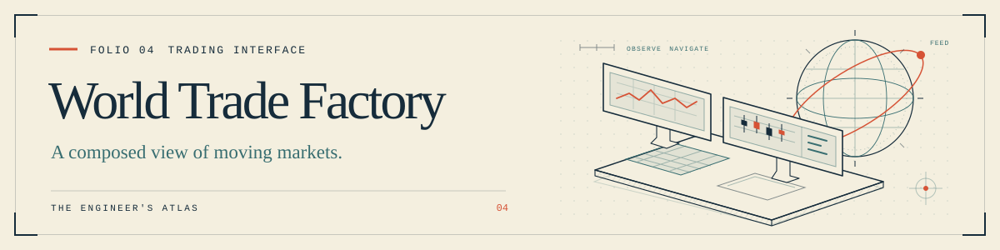
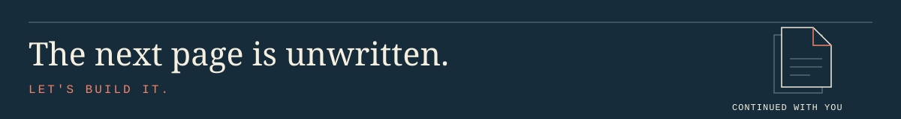

<!-- Original illustrations: assets/atlas. GIF motion is opt-in via no-preference; SVGs provide reduced-motion and legacy fallbacks. Essential content stays in native Markdown. -->

[Portfolio](https://www.creal589.dev/) &emsp; [Résumé](https://www.creal589.dev/resume) &emsp; [LinkedIn](https://www.linkedin.com/in/creal212/) &emsp; [Email](mailto:tommyfodaykailie@gmail.com)

<picture>
  <source media="(prefers-reduced-motion: no-preference) and (prefers-color-scheme: dark) and (max-width: 640px)" srcset="assets/atlas/cover-mobile-dark.gif">
  <source media="(prefers-reduced-motion: no-preference) and (max-width: 640px)" srcset="assets/atlas/cover-mobile.gif">
  <source media="(prefers-reduced-motion: no-preference) and (prefers-color-scheme: dark)" srcset="assets/atlas/cover-dark.gif">
  <source media="(prefers-reduced-motion: no-preference)" srcset="assets/atlas/cover.gif">
  <source media="(prefers-color-scheme: dark) and (max-width: 640px)" srcset="assets/atlas/cover-mobile-dark.svg">
  <source media="(max-width: 640px)" srcset="assets/atlas/cover-mobile.svg">
  <source media="(prefers-color-scheme: dark)" srcset="assets/atlas/cover-dark.svg">
  
</picture>

# Cyril Foday-Kailie

**Software engineer** Full stack development, AI systems and product design. St. Paul, Minnesota B.S. Computer Science, Metropolitan State University

I build products that make complicated systems easier to understand and use. I care about the interface, typography, and interactions people see, as well as the APIs, data pipelines, desktop tools, and AI workflows behind them.

**Open to software engineering roles.**

## The collection

Each project begins with a different problem. I design the interface and the system behind it together.

[Folio 01](#folio-01-dev-autographs) &emsp; [Folio 02](#folio-02-the-book-of-blocks) &emsp; [Folio 03](#folio-03-imperium) &emsp; [Folio 04](#folio-04-world-trade-factory)

### Folio 01. Dev Autographs

<a href="https://www.devautographs.com/">
  <picture>
    <source media="(prefers-reduced-motion: no-preference)" srcset="assets/atlas/dev-autograph.gif">
    
  </picture>
</a>

**A signature for the files you ship.** A Windows app, CLI, and web desk connect Git workflows to cryptographic file signatures and public records. The optional <kbd>Shift</kbd> + <kbd>D</kbd> report brings those records into a website without adding a permanent badge.

`Tauri` `Node.js` `Git hooks` `Ed25519` `SHA-256` <em>Early access</em>

[Explore the product](https://www.devautographs.com/) &emsp; [Open the web desk](https://www.devautographs.com/desk.html) &emsp; [Case study](https://www.creal589.dev/my-projects/dev-autographs) &emsp; [Releases](https://github.com/Creal212/Dev-Autographs-Installer/releases)

<strong>Field note:</strong> From commit to verifiable record

Enabled hooks sign staged file bytes and their recorded context. Publishing happens on push. Website reports are enabled separately. Private signing keys stay on the developer’s machine, and the registry receives fingerprints and signed records rather than source code.

The report checks the supplied file signatures and registry status. The design challenge is making that evidence understandable without interrupting the product around it.

 

### Folio 02. The Book of Blocks

<a href="https://www.bookofblocks.xyz/">
  <picture>
    <source media="(prefers-reduced-motion: no-preference)" srcset="assets/atlas/book-of-blocks.gif">
    
  </picture>
</a>

**A reading room with a market observatory next door.** Chaptered crypto guides, live rankings, price charts, and source notes share one reading experience. The project brings editorial structure to a subject that rarely slows down.

`Next.js` `React` `Supabase Realtime` `TradingView Lightweight Charts`

[Enter the observatory](https://www.bookofblocks.xyz/) &emsp; [Case study](https://www.creal589.dev/my-projects/book-of-blocks)

<strong>Field note:</strong> Making live data readable

The interface has two jobs: explain a project and show what its market is doing. Chapter navigation serves the first; rankings, charts, source notes, and visible timestamps serve the second.

The engineering work connects the reading experience to market ingestion, storage, and realtime updates. Data freshness belongs in the experience, alongside the numbers themselves.

 

### Folio 03. I.M.P.E.R.I.U.M

<a href="https://www.imperium589.world/">
  <picture>
    <source media="(prefers-reduced-motion: no-preference)" srcset="assets/atlas/imperium.gif">
    
  </picture>
</a>

**From a conversation to a reviewed change.** An AI desktop workspace for planning, building in a project clone, and reviewing patches before they reach Main. Local and connected model workflows share a deliberate human review boundary.

`Tauri` `Rust` `React` `TypeScript` `SQLite` <em>Early access</em>

[Visit the workbench](https://www.imperium589.world/) &emsp; [Case study](https://www.creal589.dev/my-projects/imperium) &emsp; [Installer repository](https://github.com/Creal212/I.M.P.E.R.I.U.M-Installer-Early-Access-)

<strong>Field note:</strong> Review before Main

Blueprint is the planning space. A project clone is the working space. Reviewed patches are the path back to Main.

That separation shapes both the architecture and the interface: model output needs to become a concrete change a person can inspect and approve. The desktop experience brings together model connections, project files, and the review workflow.

 

### Folio 04. World Trade Factory

<a href="https://wtf-trading-interface.vercel.app/">
  <picture>
    <source media="(prefers-reduced-motion: no-preference)" srcset="assets/atlas/world-trade-factory.gif">
    
  </picture>
</a>

**A market desk built around moving information.** Live feeds, price charts, and wallet connections meet in a responsive workspace. The layout moves from a desktop trading desk to focused mobile views.

`Next.js` `React` `Recharts` `WebSockets` `ethers.js` <em>Live interface. Integrations in progress.</em>

[Explore the interface](https://wtf-trading-interface.vercel.app/) &emsp; [Case study](https://www.creal589.dev/my-projects/wtf)

<strong>Field note:</strong> Keeping a busy market desk clear

Markets, charts, and trading controls need a clear hierarchy when everything is changing at once. The case study follows those layout decisions across desktop and mobile, alongside live market feeds and wallet integrations.

Execution and settlement integrations remain in progress. Saved trading rules currently live in the browser.

 

**Also on the bench: [RevOps Data Sync](https://github.com/Creal212/revops-data-sync)** A compact data engineering project: mock CRM, support, and product data move through Python ingestion and SQL cleanup into a PostgreSQL account health mart and a Metabase dashboard. `Python` `SQL` `PostgreSQL` `Metabase` `Docker`

## The working practice

**Start with the person using it.** Give complex information a clear hierarchy, useful feedback, and a deliberate interaction model.

**Make the boundaries visible.** Show what the data describes, what an AI can change, and where a human decision belongs.

**Follow the feature all the way down.** Treat the interface, API, storage, and deployment as parts of the same product.

<strong>Tools behind the work</strong>

**Interfaces:** TypeScript, JavaScript, React, Next.js, Tailwind CSS.

**Data and services:** Python, Node.js, PostgreSQL, Supabase, SQL.

**Desktop and AI workflows:** Tauri, Rust, SQLite, local and connected models.

**Delivery:** Git, Docker, Vercel, Railway.

The project links above show where these tools are used and the decisions behind them.

<strong>In the margins:</strong> A little room to play

Careful engineering. A little anime. Always another idea on the bench.

 

<a href="https://www.creal589.dev/contact-me">
  <picture>
    <source media="(prefers-reduced-motion: no-preference)" srcset="assets/atlas/colophon.gif">
    
  </picture>
</a>

**Looking for someone who cares how it works and how it feels?** I’m open to software engineering roles and thoughtful conversations about building useful products.

[Read my résumé](https://www.creal589.dev/resume) &emsp; [Explore the portfolio](https://www.creal589.dev/) &emsp; [Get in touch](mailto:tommyfodaykailie@gmail.com)

Designed as an engineer’s atlas. Illustrated as product specimens. Built to be explored.
